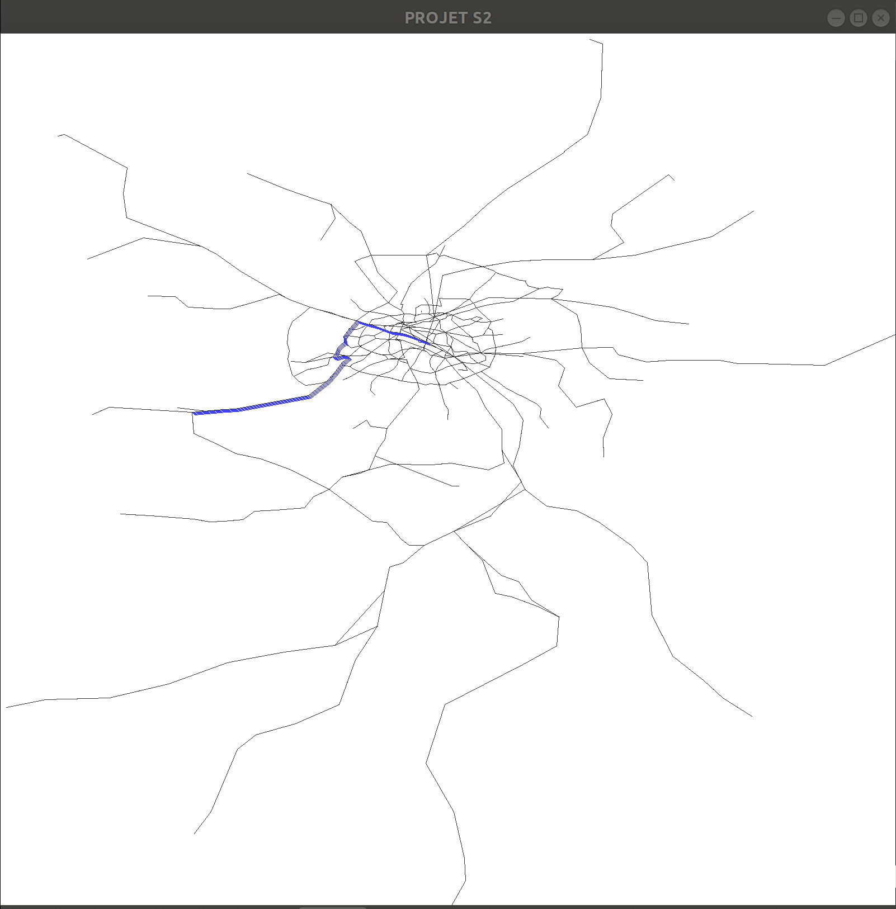
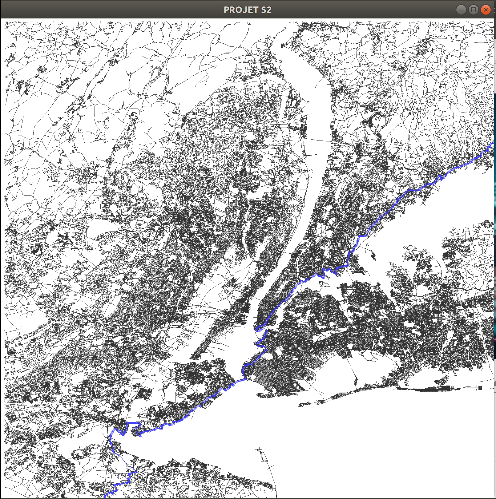

Présentation :
L'objectif de ce projet est de trouver le plus court chemin entre deux stations de métro à partir de fichiers de données.

GitHub :
Le projet a été developpé avec l'aide de la plateforme GitHub, pour une meilleure expérience nous vous invitons à ouvrir ce fichier README.md dans votre navigateur web via le lien : https://github.com/BCourteaud76/projet1A/README.md

Overview : 
Le répertoire de travail se présente de la manière suivante : 

  /src doit contenir tout les fichiers sources
  /include doit contenir tout les fichier header
  /bin contient les executables
  /data contient les fichiers de données lu lors de l'execution des programmes

Executer le code :
Il y a deux executables dans le répertoire /bin : main et vGraphique, executez-les avec la commande ./main et ./vGraphique
Ces executables prennent pour paramètre le chemin vers le fichier de données avec lequel on veut construire notre carte (graphe)
Exemple : ./vGraphique ~/Documents/tdinfo/Projet2019/grapheNewYork.csv

Compilation :
La compilation est automatisée depuis un Makefile
Dans un terminal :
  -lancer la commande make pour tout compiler
  -Vous pouvez compiler séparement : make main ou make vGraphique
  -make clean : supprime tout les fichiers objets
  -make mrproper : supprime les fichiers objets ET les executables

NB : Avant de recompiler, pensez à executer make mrproper si vous changez des variables/macros préprocesseurs nottament la résolution de la fenêtre graphique HAUTEUR et LARGEUR dans graphic.h 
  
N'hésitez pas à consulter le Makefile pour plus de détails.

Voici des exemples d'execution : 
Metro de Paris 

New York 

